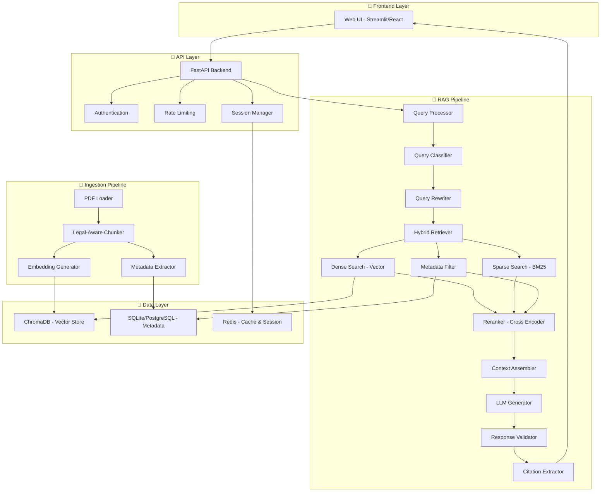
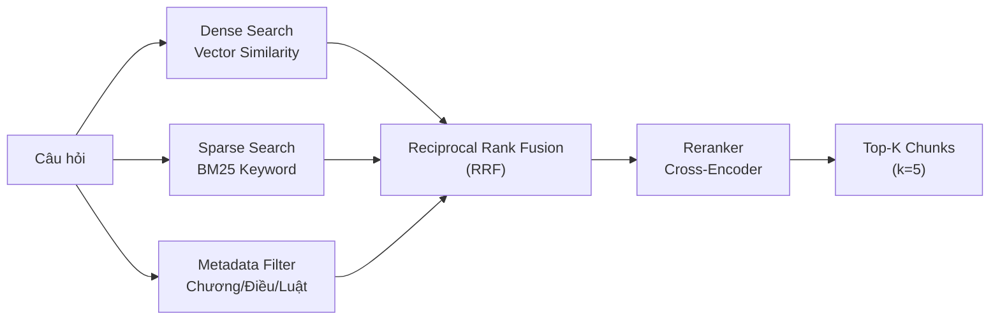
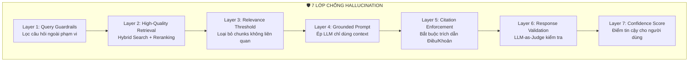

# 📋 KẾ HOẠCH XÂY DỰNG AI CHATBOT RAG - LUẬT HÔN NHÂN & KINH TẾ VIỆT NAM

> **Phiên bản:** 1.0 | **Ngày tạo:** 26/02/2026  
> **Mục tiêu:** Xây dựng hệ thống Chatbot AI sử dụng kỹ thuật RAG (Retrieval-Augmented Generation) chuyên về Luật Hôn nhân & Gia đình và Luật Kinh tế Việt Nam, đảm bảo độ chính xác cao và giảm thiểu hallucination.

---

## 📑 MỤC LỤC

1. [Tổng quan hệ thống](#1-tổng-quan-hệ-thống)
2. [Kiến trúc hệ thống (System Architecture)](#2-kiến-trúc-hệ-thống)
3. [Technology Stack](#3-technology-stack)
4. [Pipeline RAG chi tiết](#4-pipeline-rag-chi-tiết)
5. [Kỹ thuật chống Hallucination](#5-kỹ-thuật-chống-hallucination)
6. [Cấu trúc dự án (Project Structure)](#6-cấu-trúc-dự-án)
7. [Hướng dẫn Step-by-Step](#7-hướng-dẫn-step-by-step)
8. [Bảng kế hoạch triển khai](#8-bảng-kế-hoạch-triển-khai)
9. [Đánh giá và Kiểm thử](#9-đánh-giá-và-kiểm-thử)
10. [Triển khai Production](#10-triển-khai-production)

---

## 1. TỔNG QUAN HỆ THỐNG

### 1.1 Bài toán
- **Input:** File PDF Luật Hôn nhân & Gia đình, Luật Kinh tế (~50 trang) từ Chính phủ Việt Nam
- **Output:** Chatbot trả lời câu hỏi pháp luật chính xác, có trích dẫn điều luật cụ thể
- **Yêu cầu đặc biệt:** Tỉ lệ hallucination cực thấp (< 5%), bắt buộc trích nguồn

### 1.2 Nguyên tắc thiết kế

| Nguyên tắc | Mô tả |
|---|---|
| **Accuracy First** | Độ chính xác là ưu tiên số 1 — sai luật = hậu quả nghiêm trọng |
| **Grounded Response** | Mọi câu trả lời phải dựa trên nội dung luật được trích xuất |
| **Refuse Unknown** | Từ chối trả lời khi không tìm thấy thông tin — tốt hơn trả lời sai |
| **Citation Required** | Bắt buộc trích dẫn Điều, Khoản, Chương cụ thể |
| **Transparent** | Người dùng biết rõ nguồn gốc thông tin |

---

## 2. KIẾN TRÚC HỆ THỐNG

### 2.1 Sơ đồ kiến trúc tổng quan



### 2.2 Luồng xử lý chính (Main Flow)

```
Người dùng đặt câu hỏi
    ↓
[1] Query Processing: Phân loại & viết lại câu hỏi
    ↓
[2] Hybrid Retrieval: Tìm kiếm vector + keyword + metadata
    ↓
[3] Reranking: Sắp xếp lại theo độ liên quan (Cross-Encoder)
    ↓
[4] Context Assembly: Ghép ngữ cảnh + prompt template
    ↓
[5] LLM Generation: Sinh câu trả lời có cấu trúc
    ↓
[6] Validation: Kiểm tra hallucination + trích dẫn
    ↓
[7] Response: Trả kết quả + nguồn trích dẫn
```

---

## 3. TECHNOLOGY STACK

### 3.1 Bảng công nghệ

| Thành phần | Công nghệ | Lý do chọn |
|---|---|---|
| **Backend API** | FastAPI (Python 3.11+) | Async, tốc độ cao, auto-docs |
| **RAG Orchestration** | LangChain + LangGraph | Hệ sinh thái phong phú, agentic RAG |
| **Vector Database** | ChromaDB | Nhẹ, dễ tích hợp, phù hợp ~50 trang |
| **Sparse Search** | rank_bm25 | Tìm kiếm keyword chính xác cho thuật ngữ pháp lý |
| **Embedding Model** | `multilingual-e5-large` hoặc `bge-m3` | Hỗ trợ tiếng Việt tốt, multilingual |
| **Reranker** | `cross-encoder/ms-marco-MiniLM-L-12-v2` hoặc `bge-reranker-v2-m3` | Tăng độ chính xác retrieval |
| **LLM** | Google Gemini 2.0 Flash / GPT-4o-mini / Qwen2.5 | Chi phí hợp lý, hỗ trợ tiếng Việt |
| **Frontend** | Streamlit (MVP) → React (Production) | Nhanh cho prototype, scale cho production |
| **PDF Processing** | PyMuPDF (fitz) + pdfplumber | Trích xuất text + bảng từ PDF chính xác |
| **Cache** | Redis / In-memory LRU | Cache câu trả lời phổ biến |
| **Database** | SQLite (dev) → PostgreSQL (prod) | Lưu metadata, lịch sử chat |
| **Monitoring** | LangSmith / Weights & Biases | Theo dõi chất lượng RAG |

### 3.2 Lựa chọn LLM chi tiết

| Tiêu chí | Gemini 2.0 Flash | GPT-4o-mini | Qwen2.5-72B (local) |
|---|---|---|---|
| Tiếng Việt | ⭐⭐⭐⭐⭐ | ⭐⭐⭐⭐ | ⭐⭐⭐⭐ |
| Chi phí | Thấp | Trung bình | Free (cần GPU) |
| Tốc độ | Rất nhanh | Nhanh | Phụ thuộc GPU |
| Grounding | Tốt | Rất tốt | Tốt |
| Khuyến nghị | ✅ **Ưu tiên** | Tùy chọn | Self-hosted |

---

## 4. PIPELINE RAG CHI TIẾT

### 4.1 PHASE 1: Document Ingestion (Nạp tài liệu)

#### 4.1.1 PDF Processing

```python
# Kỹ thuật: Legal-Aware PDF Extraction
# Trích xuất có nhận biết cấu trúc văn bản luật

class LegalPDFProcessor:
    """
    Xử lý PDF luật với nhận biết cấu trúc:
    - Phần, Chương, Mục, Điều, Khoản, Điểm
    - Bảng biểu, phụ lục
    - Header/Footer filtering
    """
    
    def extract_with_structure(self, pdf_path):
        # 1. Dùng PyMuPDF trích text thô
        # 2. Nhận dạng cấu trúc phân cấp (regex patterns)
        # 3. Gắn metadata: chương, điều, khoản
        # 4. Loại bỏ header/footer/page numbers
        pass
```

> [!IMPORTANT]
> **Regex patterns cho luật Việt Nam:**
> - Phần: `^PHẦN THỨ\s+(NHẤT|HAI|BA|...)`
> - Chương: `^Chương\s+[IVXLCDM]+`  
> - Điều: `^Điều\s+\d+\.`
> - Khoản: `^\d+\.\s+`
> - Điểm: `^[a-z]\)\s+`

#### 4.1.2 Legal-Aware Chunking (Chia nhỏ văn bản có nhận biết cấu trúc luật)

> [!TIP]
> Đây là bước **QUAN TRỌNG NHẤT** trong toàn bộ pipeline. Chunking sai = trả lời sai.

**Chiến lược chunking cho văn bản luật:**

| Chiến lược | Mô tả | Khi nào dùng |
|---|---|---|
| **Article-Level Chunking** | Mỗi Điều luật = 1 chunk | Điều ngắn (< 500 tokens) |
| **Section-Level Chunking** | Mỗi Khoản = 1 chunk | Điều dài, nhiều khoản |
| **Hierarchical Chunking** | Giữ cấu trúc phân cấp Chương→Điều→Khoản | Truy vấn cần ngữ cảnh rộng |
| **Overlap Chunking** | Chunk có phần chồng lấn | Bổ sung cho các chiến lược trên |

```python
# Cấu hình chunking tối ưu cho luật VN
CHUNKING_CONFIG = {
    "strategy": "hierarchical_legal",  # Chiến lược chính
    "chunk_size": 512,                 # Tokens tối đa mỗi chunk
    "chunk_overlap": 100,              # Tokens chồng lấn
    "min_chunk_size": 100,             # Tránh chunk quá nhỏ
    "preserve_article_boundary": True,  # Không cắt giữa Điều
    "include_parent_context": True,     # Thêm context Chương/Mục
    "metadata_fields": [
        "chapter", "article", "section", 
        "clause", "law_name", "effective_date"
    ]
}
```

**Parent-Child Chunking (Kỹ thuật nâng cao):**
```
┌─────────────────────────────────┐
│ PARENT CHUNK (Điều 15 - toàn bộ)│  ← Dùng để trả về context
│  ┌──────────┐ ┌──────────┐     │
│  │ Child 1  │ │ Child 2  │     │  ← Dùng để tìm kiếm
│  │ Khoản 1  │ │ Khoản 2  │     │
│  └──────────┘ └──────────┘     │
│  ┌──────────┐                  │
│  │ Child 3  │                  │
│  │ Khoản 3  │                  │
│  └──────────┘                  │
└─────────────────────────────────┘
→ Tìm kiếm bằng child chunks (chính xác hơn)
→ Trả về parent chunk (đủ ngữ cảnh hơn)
```

#### 4.1.3 Embedding Generation

```python
# Embedding model tối ưu cho tiếng Việt
EMBEDDING_CONFIG = {
    "model": "intfloat/multilingual-e5-large",
    "dimension": 1024,
    "normalize": True,           # L2 normalization - QUAN TRỌNG
    "prefix_query": "query: ",   # Prefix cho câu hỏi
    "prefix_passage": "passage: ", # Prefix cho đoạn văn
    "batch_size": 32,
    "max_length": 512
}
```

#### 4.1.4 Metadata Structure

```python
# Mỗi chunk được lưu kèm metadata phong phú
chunk_metadata = {
    "law_name": "Luật Hôn nhân và Gia đình 2014",
    "law_number": "52/2014/QH13",
    "chapter": "Chương III",
    "chapter_title": "Quan hệ giữa vợ và chồng",
    "article": "Điều 15",
    "article_title": "Quyền và nghĩa vụ về nhân thân...",
    "clause": "Khoản 2",
    "effective_date": "2015-01-01",
    "source_page": 12,
    "chunk_type": "clause",        # article/clause/point
    "parent_chunk_id": "art_15",   # Liên kết parent
    "hierarchy_path": "Chương III > Điều 15 > Khoản 2"
}
```

### 4.2 PHASE 2: Query Processing (Xử lý câu hỏi)

#### 4.2.1 Query Classification

```python
# Phân loại câu hỏi để chọn chiến lược retrieval phù hợp
QUERY_TYPES = {
    "specific_article": {
        # "Điều 15 Luật HNGĐ quy định gì?"
        "strategy": "metadata_filter + dense",
        "top_k": 3
    },
    "concept_question": {
        # "Tài sản chung của vợ chồng gồm những gì?"
        "strategy": "hybrid (dense + sparse)",
        "top_k": 10
    },
    "comparison": {
        # "So sánh quyền tài sản trước và sau khi kết hôn?"
        "strategy": "multi_query + dense",
        "top_k": 15
    },
    "procedure": {
        # "Thủ tục ly hôn đơn phương như thế nào?"
        "strategy": "hybrid + agentic",
        "top_k": 10
    },
    "out_of_scope": {
        # "Thời tiết hôm nay thế nào?"
        "strategy": "reject",
        "response": "Xin lỗi, tôi chỉ hỗ trợ câu hỏi về Luật..."
    }
}
```

#### 4.2.2 Query Rewriting (Viết lại câu hỏi)

```python
# Multi-Query: Tạo nhiều biến thể để tăng recall
# Ví dụ: "Ly hôn chia tài sản thế nào?"
# → Query 1: "Quy định về phân chia tài sản khi ly hôn"
# → Query 2: "Điều luật về tài sản chung vợ chồng khi ly hôn"  
# → Query 3: "Thủ tục giải quyết tài sản trong vụ ly hôn"

QUERY_REWRITE_PROMPT = """
Bạn là chuyên gia luật Việt Nam. Hãy viết lại câu hỏi sau 
thành 3 biến thể khác nhau để tìm kiếm trong văn bản luật:
- Biến thể 1: Dùng thuật ngữ pháp lý chính thức
- Biến thể 2: Mô tả khái niệm liên quan
- Biến thể 3: Trích dẫn cụ thể (nếu có thể)

Câu hỏi gốc: {query}
"""
```

### 4.3 PHASE 3: Hybrid Retrieval (Truy xuất kết hợp)



**Reciprocal Rank Fusion (RRF):**
```python
# Công thức kết hợp kết quả từ nhiều nguồn
def reciprocal_rank_fusion(results_list, k=60):
    """
    Kết hợp kết quả từ Dense + Sparse + Metadata search
    RRF Score = Σ 1/(k + rank_i) cho mỗi document
    """
    fused_scores = {}
    for results in results_list:
        for rank, (doc_id, _) in enumerate(results):
            if doc_id not in fused_scores:
                fused_scores[doc_id] = 0
            fused_scores[doc_id] += 1.0 / (k + rank + 1)
    
    return sorted(fused_scores.items(), key=lambda x: x[1], reverse=True)
```

### 4.4 PHASE 4: Reranking

```python
RERANKING_CONFIG = {
    "model": "BAAI/bge-reranker-v2-m3",  # Multilingual reranker
    "initial_retrieval_k": 20,  # Lấy 20 chunks ban đầu
    "rerank_top_k": 5,          # Giữ lại top 5 sau rerank
    "score_threshold": 0.3,     # Loại bỏ chunks điểm thấp
    "batch_size": 16
}
```

### 4.5 PHASE 5: Prompt Engineering & Generation

```python
LEGAL_RAG_PROMPT = """
Bạn là trợ lý pháp luật chuyên về Luật Hôn nhân & Gia đình 
và Luật Kinh tế Việt Nam. 

## QUY TẮC BẮT BUỘC:
1. CHỈ trả lời dựa trên thông tin trong [NGỮ CẢNH PHÁP LUẬT] bên dưới
2. PHẢI trích dẫn Điều, Khoản, Điểm cụ thể cho mọi thông tin
3. Nếu KHÔNG tìm thấy thông tin → trả lời: "Tôi không tìm thấy 
   quy định liên quan trong văn bản luật được cung cấp. Vui lòng 
   tham khảo ý kiến luật sư chuyên nghiệp."
4. KHÔNG ĐƯỢC suy luận hay thêm thông tin ngoài văn bản luật
5. KHÔNG ĐƯỢC đưa ra lời khuyên pháp lý cá nhân
6. Dùng ngôn ngữ dễ hiểu nhưng chính xác về mặt pháp lý

## ĐỊNH DẠNG TRẢ LỜI:
**Trả lời:** [Câu trả lời dựa trên luật]

**Căn cứ pháp lý:**
- [Tên luật], Điều [X], Khoản [Y]: "[Trích dẫn nguyên văn]"

**Lưu ý:** [Thông tin bổ sung nếu cần]

---
## NGỮ CẢNH PHÁP LUẬT:
{context}

## CÂU HỎI CỦA NGƯỜI DÙNG:
{question}

## TRẢ LỜI:
"""
```

---

## 5. KỸ THUẬT CHỐNG HALLUCINATION

> [!CAUTION]
> Hallucination trong lĩnh vực pháp luật có thể gây hậu quả nghiêm trọng. Đây là phần QUAN TRỌNG NHẤT cần triển khai đầy đủ.

### 5.1 Tổng quan 7 lớp bảo vệ



### 5.2 Chi tiết từng lớp

#### Layer 1: Query Guardrails
```python
def check_query_scope(query: str) -> bool:
    """Kiểm tra câu hỏi có thuộc phạm vi luật không"""
    # Dùng LLM nhẹ hoặc classifier để phân loại
    # Từ chối: chuyện cá nhân, tư vấn, ngoài phạm vi
    pass
```

#### Layer 2: High-Quality Retrieval
- Hybrid Search (Dense + Sparse + Metadata)
- Reranking bằng Cross-Encoder
- Parent-Child retrieval

#### Layer 3: Relevance Threshold
```python
def filter_by_relevance(chunks, threshold=0.3):
    """Loại bỏ chunks có relevance score thấp"""
    filtered = [c for c in chunks if c.score >= threshold]
    if not filtered:
        return "NO_RELEVANT_CONTEXT"  # → Refuse to answer
    return filtered
```

#### Layer 4: Grounded Prompt Engineering
- Prompt yêu cầu CHỈ dùng context
- Cấm suy luận ngoài văn bản
- Yêu cầu nói "không biết" khi thiếu thông tin

#### Layer 5: Citation Enforcement
```python
def validate_citations(response: str, context_chunks: list) -> dict:
    """Kiểm tra trích dẫn trong câu trả lời có khớp context"""
    cited_articles = extract_article_references(response)
    available_articles = extract_article_references(
        " ".join([c.text for c in context_chunks])
    )
    
    # Kiểm tra mỗi trích dẫn có trong context không
    valid = all(art in available_articles for art in cited_articles)
    return {"valid": valid, "cited": cited_articles}
```

#### Layer 6: LLM-as-Judge Validation
```python
VALIDATION_PROMPT = """
Bạn là thẩm phán kiểm tra chất lượng.
Cho context pháp luật và câu trả lời, hãy đánh giá:

1. FAITHFULNESS (0-10): Câu trả lời có trung thành với context?
2. HALLUCINATION: Có thông tin nào KHÔNG CÓ trong context?
3. CITATION_ACCURACY: Trích dẫn Điều/Khoản có chính xác?

Context: {context}
Câu trả lời: {response}

Trả về JSON: {{"faithfulness": X, "has_hallucination": bool, 
               "citation_accurate": bool, "issues": [...]}}
"""
```

#### Layer 7: Confidence Score
```python
def calculate_confidence(
    retrieval_scores, 
    reranker_scores, 
    validation_result
) -> float:
    """Tính điểm tin cậy tổng hợp"""
    retrieval_conf = mean(retrieval_scores)
    rerank_conf = mean(reranker_scores) 
    validation_conf = validation_result["faithfulness"] / 10
    
    # Weighted average
    confidence = (
        0.3 * retrieval_conf +
        0.3 * rerank_conf +
        0.4 * validation_conf
    )
    return confidence
    # Hiển thị: 🟢 Cao (>0.8) | 🟡 TB (0.5-0.8) | 🔴 Thấp (<0.5)
```

---

## 6. CẤU TRÚC DỰ ÁN

```
CHATBOT_RAG/
├── 📁 data/
│   ├── 📁 raw_pdfs/                # PDF luật gốc
│   │   ├── luat_hon_nhan_gia_dinh_2014.pdf
│   │   └── luat_kinh_te.pdf
│   ├── 📁 processed/               # Dữ liệu đã xử lý
│   │   ├── chunks.json
│   │   └── metadata.json
│   └── 📁 evaluation/              # Bộ test đánh giá
│       ├── test_questions.json
│       └── ground_truth.json
│
├── 📁 src/
│   ├── 📁 ingestion/               # Pipeline nạp dữ liệu
│   │   ├── __init__.py
│   │   ├── pdf_processor.py        # Trích xuất PDF
│   │   ├── legal_chunker.py        # Chunking theo cấu trúc luật
│   │   ├── embedder.py             # Tạo embeddings
│   │   └── indexer.py              # Lưu vào vector DB
│   │
│   ├── 📁 retrieval/               # Pipeline truy xuất
│   │   ├── __init__.py
│   │   ├── query_processor.py      # Xử lý câu hỏi
│   │   ├── hybrid_retriever.py     # Dense + Sparse + Metadata
│   │   ├── reranker.py             # Cross-Encoder reranking
│   │   └── context_assembler.py    # Ghép context
│   │
│   ├── 📁 generation/              # Pipeline sinh câu trả lời
│   │   ├── __init__.py
│   │   ├── llm_client.py           # Giao tiếp LLM (Gemini/GPT)
│   │   ├── prompt_templates.py     # Prompt templates
│   │   └── response_parser.py      # Parse & format response
│   │
│   ├── 📁 validation/              # Kiểm tra hallucination
│   │   ├── __init__.py
│   │   ├── citation_checker.py     # Kiểm tra trích dẫn
│   │   ├── faithfulness_check.py   # LLM-as-Judge
│   │   └── confidence_scorer.py    # Tính điểm tin cậy
│   │
│   ├── 📁 api/                     # FastAPI endpoints
│   │   ├── __init__.py
│   │   ├── main.py                 # FastAPI app
│   │   ├── routes.py               # API routes
│   │   └── models.py               # Pydantic models
│   │
│   └── 📁 utils/                   # Tiện ích
│       ├── __init__.py
│       ├── config.py               # Cấu hình
│       └── logger.py               # Logging
│
├── 📁 frontend/                    # Giao diện
│   └── streamlit_app.py            # Streamlit UI
│
├── 📁 tests/                       # Unit & Integration tests
│   ├── test_chunker.py
│   ├── test_retrieval.py
│   └── test_validation.py
│
├── 📁 evaluation/                  # Scripts đánh giá
│   ├── evaluate_retrieval.py
│   ├── evaluate_generation.py
│   └── evaluate_hallucination.py
│
├── 📁 vectorstore/                 # ChromaDB persistent storage
├── .env                            # API keys (KHÔNG commit)
├── config.yaml                     # Cấu hình hệ thống
├── requirements.txt                # Python dependencies
├── Dockerfile                      # Docker container
├── docker-compose.yml              # Docker compose
└── README.md                       # Tài liệu
```

---

## 7. HƯỚNG DẪN STEP-BY-STEP

### STEP 1: Thiết lập môi trường (Ngày 1-2)

```bash
# 1. Tạo virtual environment
python -m venv venv
venv\Scripts\activate  # Windows

# 2. Cài đặt dependencies
pip install -r requirements.txt
```

**requirements.txt:**
```
# Core
fastapi==0.115.*
uvicorn==0.34.*
python-dotenv==1.0.*

# RAG Pipeline
langchain==0.3.*
langchain-community==0.3.*
langchain-google-genai==2.*      # Gemini
chromadb==0.6.*
sentence-transformers==3.*

# PDF Processing
pymupdf==1.25.*
pdfplumber==0.11.*

# Retrieval
rank-bm25==0.2.*

# Frontend
streamlit==1.42.*

# Evaluation
ragas==0.2.*
datasets==3.*

# Utils
pydantic==2.*
pyyaml==6.*
redis==5.*
```

### STEP 2: Xử lý PDF & Trích xuất (Ngày 3-5)

**Triển khai `pdf_processor.py`:**
1. Đọc PDF bằng PyMuPDF
2. Nhận dạng cấu trúc: Chương → Điều → Khoản → Điểm (regex)
3. Trích xuất text sạch + metadata
4. Loại bỏ header, footer, số trang
5. Xử lý ký tự đặc biệt tiếng Việt

### STEP 3: Legal-Aware Chunking (Ngày 6-8)

**Triển khai `legal_chunker.py`:**
1. Chia chunk theo ranh giới Điều luật
2. Áp dụng Parent-Child chunking
3. Thêm context header cho mỗi chunk (Tên luật + Chương + Điều)
4. Gắn metadata phong phú
5. Overlap 100 tokens giữa các chunks

### STEP 4: Embedding & Indexing (Ngày 9-10)

**Triển khai `embedder.py` & `indexer.py`:**
1. Load model `multilingual-e5-large` (HuggingFace)
2. Tạo embeddings cho tất cả chunks (batch processing)
3. L2 normalize vectors
4. Lưu vào ChromaDB với metadata
5. Tạo BM25 index song song

### STEP 5: Hybrid Retrieval (Ngày 11-14)

**Triển khai `hybrid_retriever.py`:**
1. Dense search: ChromaDB similarity search
2. Sparse search: BM25 keyword matching
3. Metadata filter: Lọc theo Chương/Điều/Luật
4. Reciprocal Rank Fusion (RRF) kết hợp kết quả
5. Cross-Encoder reranking (top 20 → top 5)

### STEP 6: Prompt Engineering & Generation (Ngày 15-17)

**Triển khai `prompt_templates.py` & `llm_client.py`:**
1. Thiết kế System Prompt chuyên pháp luật
2. Template bắt buộc trích dẫn Điều/Khoản
3. Few-shot examples cho các loại câu hỏi
4. Kết nối Gemini API (hoặc GPT-4o-mini)
5. Streaming response

### STEP 7: Validation & Anti-Hallucination (Ngày 18-21)

**Triển khai module `validation/`:**
1. Citation checker: Regex match Điều/Khoản
2. Faithfulness check: LLM-as-Judge
3. Confidence scoring
4. Auto-reject khi confidence thấp
5. Fallback response template

### STEP 8: API Backend (Ngày 22-24)

**Triển khai `api/`:**
1. FastAPI endpoints: `/chat`, `/upload`, `/health`
2. Session management
3. Chat history storage
4. Rate limiting
5. Error handling

### STEP 9: Frontend UI (Ngày 25-28)

**Triển khai Streamlit UI:**
1. Giao diện chat
2. Hiển thị trích dẫn nguồn (expandable)
3. Confidence indicator (🟢🟡🔴)
4. Upload PDF mới
5. Lịch sử hội thoại

### STEP 10: Đánh giá & Tối ưu (Ngày 29-35)

1. Tạo 100+ câu hỏi test + ground truth
2. Đánh giá bằng RAGAS metrics
3. Tối ưu chunking, retrieval, prompt
4. A/B testing các LLM models
5. Stress testing

### STEP 11: Triển khai Production (Ngày 36-40)

1. Docker containerization
2. CI/CD pipeline
3. Monitoring & logging (LangSmith)
4. Documentation
5. User testing

---

## 8. BẢNG KẾ HOẠCH TRIỂN KHAI

| Phase | Tuần | Công việc | Output | Kỹ thuật áp dụng |
|---|---|---|---|---|
| **Phase 1** | Tuần 1 | Setup + PDF Processing | Dữ liệu text sạch + metadata | PyMuPDF, Regex, Legal Structure Recognition |
| **Phase 2** | Tuần 2 | Chunking + Embedding + Indexing | Vector DB sẵn sàng | Legal-Aware Chunking, Parent-Child, E5-Large, ChromaDB |
| **Phase 3** | Tuần 3 | Hybrid Retrieval + Reranking | Retrieval pipeline hoạt động | Dense+Sparse Search, RRF, Cross-Encoder Reranking |
| **Phase 4** | Tuần 4 | LLM Integration + Prompt Engineering | Chatbot trả lời được | Grounded Prompting, Few-shot, Gemini API |
| **Phase 5** | Tuần 5 | Anti-Hallucination + Validation | 7 lớp bảo vệ hoạt động | LLM-as-Judge, Citation Check, Confidence Score |
| **Phase 6** | Tuần 6 | API + Frontend | Sản phẩm MVP hoàn chỉnh | FastAPI, Streamlit, Session Management |
| **Phase 7** | Tuần 7 | Evaluation + Optimization | Metrics đạt chuẩn | RAGAS, A/B Testing, Hyperparameter Tuning |
| **Phase 8** | Tuần 8 | Production + Polish | Sản phẩm production | Docker, CI/CD, Monitoring |

---

## 9. ĐÁNH GIÁ VÀ KIỂM THỬ

### 9.1 Metrics đánh giá

| Metric | Mô tả | Mục tiêu |
|---|---|---|
| **Faithfulness** | Câu trả lời có trung thành context? | > 0.90 |
| **Answer Relevancy** | Câu trả lời có liên quan câu hỏi? | > 0.85 |
| **Context Precision** | Chunks truy xuất có chính xác? | > 0.80 |
| **Context Recall** | Có truy xuất đủ thông tin? | > 0.85 |
| **Hallucination Rate** | Tỉ lệ hallucination | < 5% |
| **Citation Accuracy** | Trích dẫn Điều/Khoản có đúng? | > 95% |
| **Latency** | Thời gian phản hồi | < 5 giây |

### 9.2 Bộ test questions (Ví dụ)

```json
[
  {
    "question": "Điều kiện kết hôn theo Luật HNGĐ 2014 là gì?",
    "expected_articles": ["Điều 8"],
    "category": "specific_article"
  },
  {
    "question": "Tài sản chung vợ chồng bao gồm những gì?",
    "expected_articles": ["Điều 33"],
    "category": "concept"
  },
  {
    "question": "Thủ tục ly hôn đơn phương diễn ra thế nào?",
    "expected_articles": ["Điều 56", "Điều 57"],
    "category": "procedure"
  }
]
```

---

## 10. TRIỂN KHAI PRODUCTION

### 10.1 Docker Setup

```yaml
# docker-compose.yml
version: '3.8'
services:
  backend:
    build: .
    ports:
      - "8000:8000"
    environment:
      - GOOGLE_API_KEY=${GOOGLE_API_KEY}
    volumes:
      - ./vectorstore:/app/vectorstore
      - ./data:/app/data

  frontend:
    build: ./frontend
    ports:
      - "8501:8501"
    depends_on:
      - backend

  redis:
    image: redis:7-alpine
    ports:
      - "6379:6379"
```

### 10.2 Monitoring Checklist

- [ ] LangSmith tracing cho mọi query
- [ ] Alert khi hallucination rate > 5%
- [ ] Log retrieval scores để phân tích
- [ ] Dashboard metrics realtime
- [ ] User feedback collection

---

## 📊 TỔNG KẾT CÁC KỸ THUẬT TỐI ƯU ÁP DỤNG

| # | Kỹ thuật | Mục đích | Tầm quan trọng |
|---|---|---|---|
| 1 | **Legal-Aware Chunking** | Chunk theo cấu trúc Điều/Khoản/Điểm | ⭐⭐⭐⭐⭐ |
| 2 | **Parent-Child Retrieval** | Tìm chính xác, trả về đủ context | ⭐⭐⭐⭐⭐ |
| 3 | **Hybrid Search (Dense+Sparse)** | Kết hợp semantic + keyword matching | ⭐⭐⭐⭐⭐ |
| 4 | **Cross-Encoder Reranking** | Tăng precision retrieval | ⭐⭐⭐⭐ |
| 5 | **Reciprocal Rank Fusion** | Kết hợp kết quả từ nhiều nguồn | ⭐⭐⭐⭐ |
| 6 | **Multi-Query Rewriting** | Tăng recall, bắt nhiều góc | ⭐⭐⭐⭐ |
| 7 | **Grounded Prompting** | Ép LLM chỉ dùng context | ⭐⭐⭐⭐⭐ |
| 8 | **Citation Enforcement** | Bắt buộc trích dẫn Điều/Khoản | ⭐⭐⭐⭐⭐ |
| 9 | **LLM-as-Judge Validation** | Kiểm tra hallucination tự động | ⭐⭐⭐⭐⭐ |
| 10 | **Confidence Scoring** | Cảnh báo người dùng khi không chắc | ⭐⭐⭐⭐ |
| 11 | **Multilingual Embeddings** | Hỗ trợ tiếng Việt chính xác | ⭐⭐⭐⭐⭐ |
| 12 | **Metadata-Rich Indexing** | Lọc nhanh theo Chương/Điều/Luật | ⭐⭐⭐⭐ |
| 13 | **Query Classification** | Chọn chiến lược tối ưu cho từng loại | ⭐⭐⭐ |
| 14 | **Refuse-to-Answer** | Từ chối khi không đủ thông tin | ⭐⭐⭐⭐⭐ |
| 15 | **RAGAS Evaluation** | Đánh giá định lượng chất lượng | ⭐⭐⭐⭐ |

> [!NOTE]
> Tài liệu này là **bản kế hoạch tổng thể**. Trong các bước tiếp theo, chúng ta sẽ triển khai code cụ thể cho từng module. Hãy bắt đầu từ **STEP 1** và tiến hành tuần tự.
